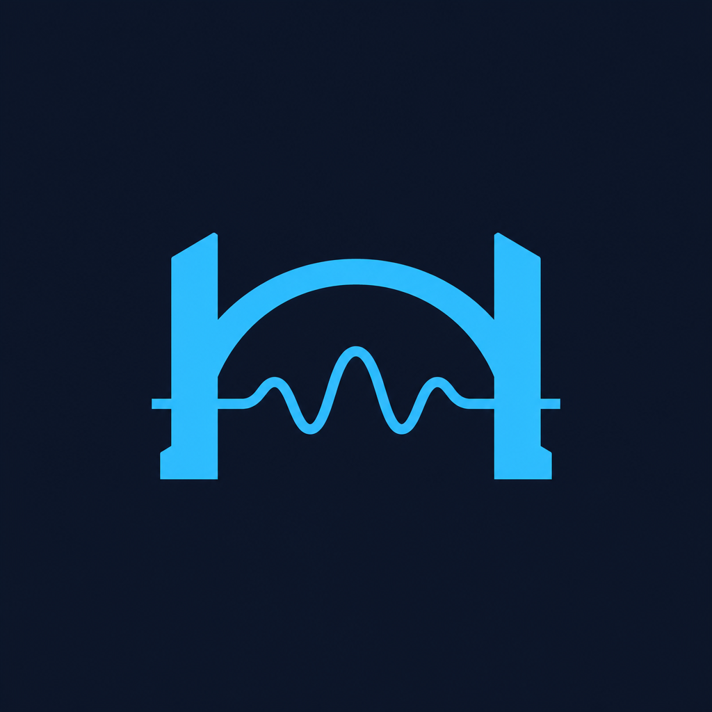

# Signal Bridge

<p align="center">
  
</p>

**Signal Bridge** connects household services to the screens in your house. It listens to Alexa and a dozen other services, bridges what it hears across the LAN, and gives you a phone UI — **Signal** — to push content, run the house Vestaboard, play games, and manage displays.

It drives two very different kinds of display:

- **Full displays** — the [**Windows display client**](alexa%20broadcast%20client/README.md) on a poster PC, movie screen, or kitchen screen. Fullscreen overlays over UDP.
- **Vestaboards** — split-flap boards over the Vestaboard Local API. 6 rows × 22 columns, no images, one house queue. A built-in **simulator** means you can run and develop the whole feature without owning a board.

Alexa voice capture uses `alexa-remote2` (unofficial); there is **no supported Amazon API** for passive listening.

> **Required for any real LAN deploy:** set a shared **LAN UDP secret** (`LAN_UDP_SECRET` on the bridge, matching `udpSecret` on every display). Without it, overlays, remote keyboard/mouse, reboot, and `web.open` travel as **plaintext UDP** — anyone on the LAN can forge them. See [LAN UDP encryption](#lan-udp-encryption). Generate with `openssl rand -base64 32`.

---

## Contents

- [Features at a glance](#features-at-a-glance)
- [What it captures from Alexa](#what-it-captures-from-alexa)
- [Integrations that watch on their own](#integrations-that-watch-on-their-own)
- [How it works](#how-it-works)
- [Signal (web UI)](#signal-web-ui)
- [Household accounts](#household-accounts)
- [Vestaboard](#vestaboard)
- [Skills catalog](#skills-catalog)
- [Games](#games)
- [Guests: Snaps, Guest Book, short links](#guests-snaps-guest-book-short-links)
- [Display Scheduler](#display-scheduler)
- [Display discovery](#display-discovery)
- [LAN UDP encryption](#lan-udp-encryption)
- [Browser on the display (WebView2)](#browser-on-the-display-webview2)
- [Repository layout](#repository-layout)
- [Prerequisites](#prerequisites)
- [Quick start (development)](#quick-start-development)
- [Production deployment (QNAP NAS)](#production-deployment-qnap-nas)
- [Configuration](#configuration)
- [API keys and secrets](#api-keys-and-secrets)
- [Log files and runtime data](#log-files-and-runtime-data)
- [UDP protocol](#udp-protocol-v2-payloads-optional-v3-encrypted-wire)
- [Testing](#testing)
- [Diagnostics](#diagnostics)
- [Notes](#notes)

---

## Features at a glance

| Area | What you get |
|------|----------------|
| **Voice → display** | Announcements, time, weather, indoor temp, air quality, timers, reminders, alarms, shopping list, music, smart home, Tesla, Vivint, notifications |
| **Vestaboard** | Split-flap boards as a first-class display: one house queue with dwell, jump/hold priorities and quiet hours, **76 skills** (44 of them board-only), a scheduler, and a measured **simulator** on port 7000 so you can build without hardware |
| **Signal (web UI)** | Landing page at `https://<NAS_IP>:47810/` with household sign-in, linking games, photos, guest book, the household app and admin |
| **Household accounts** | Named accounts with password login, avatars, per-user permissions, a self-serve **`/user/`** app (Message the board, Skills dashboard, Game Sessions, shared simulator), Gmail-sent password resets, and an append-only audit log |
| **Admin UI** | `https://<NAS_IP>:47810/admin/` — Push, Remote, Control, Scheduler, Slideshow, Roll Credits, Vestaboard Simulator, Flight Plan, Settings |
| **Games** | Four multiplayer party games played on phones with the board as the shared screen: **Word Scramble**, **Party Prompts**, **Wheel of Fortune**, **Hangman** |
| **Now Playing** | Steam, PlayStation Network, YouTube (Lounge), Plex (**Feature Presentation**, board only), plus Alexa music — cards open and close on their own |
| **Live scoreboards** | **Autodarts** matches and house leaderboard, **Huupe Mini** basketball sessions and career dashboard |
| **Feeds and facts** | The Upside News, Wikipedia Common Knowledge, trivia, weather report / alerts / US map, stocks, currency, ISS, Starlink, launches, flights overhead, and a large shelf of house-editable card skills |
| **Display discovery** | Each Windows client **advertises** itself (`display.announce` on UDP `:47833`); Signal lists them live and can target one, all, or a board. Duplicate names are OK — the picker shows `Name · ab12` when names collide |
| **Display Scheduler** | Rules that program the wall when nothing else is on — per-rule interval, importance, quiet windows, target (`full` / `all` / `vestaboard` / one display), activity history and heatmaps |
| **Guests** | PIN-gated photo booth at `/guestsnaps/`, a public **Guest Book** at `/guestbook/` that writes to the board, and TinyURL short links for both |
| **In-browser on the display** | Push any URL → fullscreen **WebView2** browser on the poster PC until you close it |
| **Remote input (PIN unlock)** | Mouse / keyboard / reboot / power-off require unlocking the selected display: a 6-digit PIN appears on that screen; enter it on the phone to unlock for ~1 hour |
| **Roll Credits** | Keep a personal completed-games library, then push or schedule an image-only dashboard and game showcase tour (`credits.show` / `roll-credits.tour`). Manual tours loop; scheduled tours walk once |
| **Flight Plan** | Trips, AeroDataBox schedules, live ADS-B, a next-flight card and a trip board |

---

## What it captures from Alexa

| Category | Example voice commands | UDP `type` |
|----------|------------------------|------------|
| **Broadcasts / announcements** | "Alexa, announce dinner is ready" | `broadcast` |
| **Time** | "Alexa, what time is it?" | `time.query` |
| **Outdoor weather** | "Alexa, what's the weather?" / "what's the temperature?" | `weather.query` |
| **Indoor temperature** | "Alexa, what's the temperature on the top floor?" | `indoor-temperature.query` |
| **Air quality** | "Alexa, what is the air quality?" | `air-quality.query` |
| **Timers** | Set, cancel, "show my timers", timer fired | `timer.snapshot` |
| **Reminders** | "Remind me in an hour" / reminder coming due | `reminder.fired` |
| **Alarms** | "Alexa, show my alarms" / set / cancel | `alarm.snapshot` |
| **Shopping list** | "Alexa, show my shopping list" / "add milk to my shopping list" | `shopping-list.snapshot` |
| **Music** | "Alexa, play …", "what's playing", or "next"/"skip" (music only — not news/briefing) | `music.playing` |
| **Smart home** | "Alexa, turn the kitchen lights on" | `smart-home.command` |
| **Tesla battery** | Custom routine: "Alexa, show Tesla battery" | `tesla-battery.query` (Fleet API when configured) |
| **Tesla dashboard** | Custom routine: "Alexa, show Tesla dashboard" | `tesla-dashboard.query` (Fleet API `vehicle_data`) |
| **Vivint alarm** | "Alexa, ask Vivint to arm" | `vivint-alarm.query` |
| **Notifications** | "Alexa, show my notifications" | `alexa-notifications.query` |
| **Routes** | "Alexa, how far is Moab from here?" | `route-planner.query` |
| **Trivia / library tours / Now Playing** | Custom routines: "open trivia", "steam library tour", "show what I'm playing" | `trivia.*`, `*.library-tour`, `*.now-playing` |
| **Guest Snaps** | "Alexa, open guest snaps" / "open guest snaps slideshow" | `guest.photobooth`, `photo.slideshow` |

All captured events are logged to **`data/voice-events.jsonl`** and sent over UDP. Voice categories can be toggled in `config.json` under `voiceEvents` (see [Configuration](#configuration)). Timer sync runs independently and still emits `timer.snapshot` even when other voice events are disabled.

---

## Integrations that watch on their own

These need no voice command. The bridge polls or subscribes, then opens and closes the card by itself.

| Integration | What it shows | Auth |
|-------------|---------------|------|
| **Steam** | Now Playing card while the linked account is in a game; library tours; last played | Web API key + Steam OpenID sign-in |
| **PlayStation Network** | Now Playing from PSN presence, enriched with playtime and trophies | NPSSO sign-in (unofficial API) |
| **YouTube** | What a linked TV is playing, with channel art and counts | YouTube Data API key + Lounge pairing |
| **Plex** | **Feature Presentation** cinema frames for the theater player, plus **Plex Top 10 Movies** — Vestaboard only, never UDP | Plex token |
| **Autodarts** | Live match on the wall, plus an archived house leaderboard | Autodarts login or device link |
| **Huupe Mini** | Live basketball session (Family Mode standings or free play) and a career dashboard | Local ADB to the hoop |
| **Tesla** | Battery and full mission-control dashboard, with a cached fallback when the car sleeps | Tesla Fleet API |
| **Ring** | Doorbell alerts on the board | In-app sign-in |
| **Flight Plan** | Next flight and trip board from AeroDataBox schedules and live ADS-B | RapidAPI (AeroDataBox) key |
| **The Upside News / Wikipedia / trivia / weather / markets / sky** | Feed and fact pages for both display kinds | Mostly keyless; Guardian and Finnhub keys are optional |

---

## How it works

```
Echo / Alexa app  →  Amazon cloud  →  Bridge (NAS Docker, host network)
                                          │
      ┌───────────────────────────────────┼───────────────────┬─────────────────────┐
      ▼                                   ▼                   ▼                     ▼
 data/voice-events.jsonl            HTTPS :47810         UDP :47832        HTTP → Vestaboard
 (audit log)                        Signal (web UI)      overlays          Local API (:7000)
                                          │                   │                     │
                                          │        ┌──────────┴──────────┐   ┌──────┴───────┐
                                          │        ▼                     ▼   ▼              ▼
                                          │  Windows display    (more PCs)  hardware    simulator
                                          │  client                          board       board
                                          │        │
                                          │  ┌─────┼─────┐
                                          │  ▼     ▼     ▼
                                          │ Tk  WebView2  mouse/key
                                          │ overlay browser
                                          │
                                          └──── display.announce ←── UDP :47833
```

1. **Push path:** Amazon sends device-activity WebSocket events → bridge parses them immediately.
2. **History fallback:** Volume changes, reconnects, and periodic polls call `getCustomerHistoryRecords()` for anything missed.
3. **On match:** Build a typed payload → append one JSON line to **`data/voice-events.jsonl`** → send UDP to display client(s) on **`:47832`**, and/or format 6×22 frames and submit them to the house Vestaboard queue.
4. **Timers / alarms:** Amazon's notifications API is polled; lists and fire/set events emit snapshot UDP payloads.
5. **Display discovery:** Each client periodically unicasts `display.announce` to the NAS on **`:47833`** (and replies to `display.discover`). The bridge keeps `data/displays-registry.json` and Signal updates live (SSE).
6. **Signal UI:** The HTTPS UI can push any page, open/close a browser URL, reboot/power off, inject mouse/keyboard to a **selected** display, and run the board.

Boards and full displays share one router. A push can target `full` (UDP only), `vestaboard` (every enabled board), `all`, or one display id.

On startup, the bridge rebuilds broadcast dedup fingerprints from **`data/voice-events.jsonl`**. Legacy **`broadcast.txt`** files (if present from older installs) are still read once for dedup migration but are no longer written.

---

## Signal (web UI)

Accept the self-signed certificate once, or issue a real one (see [DOCKER.md](DOCKER.md) → Let's Encrypt). Optional HTTP redirect: `:47811` → HTTPS.

| URL | Who | What |
|-----|-----|------|
| `https://<NAS_IP>:47810/` | Everyone | Landing page — household sign-in plus tiles for Games, Guest Snaps, Guest Book and Admin |
| `https://<NAS_IP>:47810/user/` | Household users | The household app — message the board, Skills dashboard, Game Sessions, shared Vestaboard simulator, plus Flight Plan / Slideshow / Date Book by permission |
| `https://<NAS_IP>:47810/guestsnaps/` | Guests | Photo booth — PIN-gated; pick a display and share one or more photos |
| `https://<NAS_IP>:47810/guestbook/` | Guests | Guest book — compose a message on a live board preview and send it to the Vestaboard |
| `https://<NAS_IP>:47810/games/` | Guests | Word Scramble, Party Prompts, Wheel of Fortune, Hangman — join with the code on the board |
| `https://<NAS_IP>:47810/admin/` | Host | Full control UI (household admin account) |
| `https://<NAS_IP>:47810/privacy` and `/terms` | Everyone | Household privacy policy and terms (used for Google OAuth consent) |

**Alexa "Guest Snaps":** say *Alexa, open guest snaps* to put a dual-QR welcome on every display (join home Wi‑Fi, then open the booth). Say *Alexa, open guest snaps slideshow* to play every stored guest photo on all displays. Prefer these over "photobooth" — Alexa reserves that word. Set `GUEST_WIFI_SSID` / `GUEST_WIFI_PASSWORD` in `.env`.

Admin tabs after login:

| Tab | Actions |
|-----|---------|
| **Push** | Every pushable page, filed under Home / Games / Media / News / Language / Travel / Share, with search. Plus the hand-built Web Browser and QR Code cards |
| **Remote** | Reboot / power off the selected display PC |
| **Control** | Touchpad + on-screen keyboard + send-text (single display only) |
| **Scheduler** | Rules that air pages on their own, with activity history, stats and a simulate button |
| **Slideshow** | Camera-roll manager for shared photos |
| **Roll Credits** | Completed-games library, artwork, tours |
| **Vestaboard Simulator** | The board as it looks on the wall, the live house queue (drag to reorder, cancel, clear, release holds) and the last API calls |
| **Flight Plan** | Trips and flights |
| **Settings** | Global / Accounts / YouTube / Games / News / Language / Travel / Media — house pin and timezone, user management, board list, every skill's corpus and filters, integrations and re-auth |

**Display picker** (sticky at the top): **All Displays** first, then the simulator, then Windows clients and boards. Selecting a board hides Remote and Control (UDP only) and filters the Push grid to board-capable pages. Refresh asks every client to re-announce; new displays appear without reloading the page.

**Requirements:** Bridge `webServer.enabled` (default on), `ADMIN_USERNAME` + `ADMIN_PASSWORD` set, Docker `network_mode: host`, and at least one display client with `bridgeHosts` pointing at the NAS (see [Display discovery](#display-discovery)).

iPhone camera QR needs HTTPS + accepting the cert. Put your NAS LAN IP in `webServer.certHosts` (or `PROXY_OWN_IP`) before the first cert is generated, or delete `data/web-certs/` and restart after updating hosts.

---

## Household accounts

Signal has real accounts, not one shared password. `ADMIN_USERNAME` / `ADMIN_PASSWORD` in `.env` bootstrap the first admin; everyone else is created from the admin UI.

| Piece | Detail |
|-------|--------|
| **Sign-in** | Username + password on the landing page or `/admin/login.html`. Sessions are `signal_session` cookies (`ADMIN_SESSION_HOURS`, default 12) with progressive per-IP lockout on bad tries |
| **User management** | Admin → **Settings → Accounts** (and the header dialog): user cards, an editor sheet, and a set-password sheet used for both create and reset. Password fields are masked with a Show toggle |
| **Permissions** | Admins get everything. Other users can be granted `flightPlan`, `slideshow` and `redLetter` — each one adds a tab to `/user/` |
| **Avatars** | Uploaded per user, stored in `data/user-avatars/`, served at `/user-avatars/` |
| **Password mail** | Generated passwords and reset links are sent with the Gmail API (`gmail.send` scope only). Link the mailbox in Settings → Accounts → Email |
| **Audit** | `data/user-audit.jsonl` records login, password change, account create/update and Gmail link — never secrets. The Audit table in the admin reads it |
| **Storage** | `data/house-users.json`; password hashes are scrypt and the file is encrypted through `secret-box` |

The `/user/` app is the non-admin half of Signal: write a message straight to the board, run the Skills dashboard (drag your favourite pages into place), watch and join game sessions, and open the shared board simulator.

---

## Vestaboard

A Vestaboard is 6 rows of 22 split-flap modules. No pixels, no images — the bridge composes every page as character codes and posts it over the **Local API**.

**Adding a board:** Settings → Media → Vestaboards → add name, address (`http://<board-ip>:7000`) and the board's Local API key. Keys are encrypted into `data/vestaboard-settings.json` (or name a `tokenEnv` instead). Each row shows live health (`OK` / `Key refused` / `Not answering` / `Off`), a **Test flip**, an on/off switch and quiet hours.

**The house queue.** Every board follows one line, so what you see is the same everywhere:

| Concept | What it means |
|---------|----------------|
| **Rate window** | The board's own flap cooldown (~15s). Nothing posts inside it |
| **Dwell** | How long a rotation page stays before the next one may flip. One house-wide value (Settings → Media → Vestaboards → Global Settings) |
| **Jump** | The page goes to the front of the line |
| **Now (immediate)** | It also cuts off the dwell of whatever is showing |
| **Hold** | A live session (a game, Huupe, Autodarts) owns the board until it ends, a higher-listed page jumps, or the safety timeout fires |
| **Quiet hours** | Per board. Only fired timers and alarms pass, plus anything explicitly marked exempt |
| **Priorities** | The **Priorities** sheet (Settings → Media → Vestaboards → Global Settings) is the house list of what jumps, what cuts in now, and what holds. "Use recommended" restores the defaults |

**The simulator.** A stand-in board that speaks the real Local API on **port 7000** — same headers, same 401/400/503 behaviour, same rate window. It is enabled by default and seeded on first boot, so a fresh clone can exercise the whole feature with no hardware. The admin **Vestaboard Simulator** tab renders the Flagship bezel, plays the recorded flap sound on a drum walk, and shows the pending queue and the last 20 API calls. The same board is shared read-only into `/user/`.

`npm run board-replay` feeds a slice of `voice-events.jsonl` through the real router against a temporary simulator, which is how frame regressions get caught in bulk.

---

## Skills catalog

A **skill** is a page the bridge can compose and put on a display. There are **76**: 71 can be pushed by hand, 74 can be scheduled, and **44 are Vestaboard-only** (marked **B** below — there is no full-display version, so pushing them at a Windows client does nothing).

Most card skills keep their corpus in `data/`, and the admin can search, edit, hide, add and test-push entries without touching the repo.

**Home**
Weather Forecast · Weekly Weather Report **B** · US Weather Map **B** · Weather Alerts **B** · Quiet Hours Reminder **B** · Shopping List · Active Timers · Indoor Air Quality · Show Alarms · Show Notifications · Calendar Clock **B** · Word Clock **B** · Ring Doorbell **B** · Red Letter **B**

**Games**
Steam · Steam last played · Steam Library Tour · PSN · PSN last played · PSN Library Tour · Roll Credits · Autodarts · Autodarts last match · Autodarts Dashboard · Huupe Live · Huupe last game · Huupe Dashboard · Trivia · Word Scramble **B** · Party Prompts **B** · Wheel of Fortune **B** · Hangman **B** · Word Riddles **B**

**Media**
Shared Photo Slideshow · Alexa Now Playing · YouTube · YouTube last played · Feature Presentation **B** · Plex Top 10 Movies **B**

**News**
The Upside News · Wikipedia Common Knowledge · Chuck Norris Fun Facts **B** · Roast Me! **B** · Family Quotes **B** · Warm Fuzzies **B** · Daily Bucket Fillers **B** · Misheard Lyrics **B** · Periodic Table **B** · US State Facts **B** · Word of the Day **B** · Dad Jokes **B** · Amazing Facts **B** · World Geography Facts **B** · Conversation Starters **B** · Stoic Quotes **B** · On This Day in History **B** · Baking Inspiration **B** · World Population Tracker **B** · Stock Market **B** · World Currency Rates **B**

**Language**
Learn Japanese **B** · Learn Portuguese **B** · Learn Spanish **B** · Learn French **B** · Learn German **B** · Learn Italian **B**

**Travel**
Tesla Dashboard · Tesla Battery · Overhead · International Space Station **B** · Starlink Tracker **B** · Space Launch Alerts **B** · Next Flight · Trip Board

**Share**
Guest Snaps · Guest Book Invite **B**

`GET /api/commands` returns this catalog with each page's category, target kinds and duration, which is what the Push grid, the Skills dashboard and the Scheduler all build themselves from.

---

## Games

Four party games. Phones are the controllers, the Vestaboard is the shared screen, and everybody joins at `/games/` with the 4-letter code the board shows (or by scanning the short link).

| Game | Players | How a round goes |
|------|---------|------------------|
| **Word Scramble** | 1+ | A 4×4 grid on the board; find words on your phone. Longer words score more |
| **Party Prompts** | 3+ | Everyone answers the prompt, then votes — no names until the reveal |
| **Wheel of Fortune** | 2+ | Spin the 24-wedge wheel, buy vowels, call letters, solve the puzzle |
| **Hangman** | 1+ | Alone, the house deals the word. With company, one phone sets it and the rest take turns on six shared lives; the setter's seat rotates each round |

Sessions run `invited → lobby → round → intermission → … → final`, take the board's hold lane while they are live, and archive to `data/game-sessions/YYYY-MM.jsonl`. Timings, player limits, late join and the shared short link are under **Settings → Games**; live and past sessions are visible to admins and to household users.

Invites are Vestaboard pages, so a game needs a board — the built-in simulator counts, which is how the games are developed and tested.

---

## Guests: Snaps, Guest Book, short links

| Feature | How it works |
|---------|--------------|
| **Guest Snaps** (`/guestsnaps/`) | 6-digit PIN gate; the code rotates every 24h and is shown on the Guest Snaps overlay ("Request PIN" pushes that overlay). After unlock, guests pick a display and queue one or more photos — one photo is a hero QR card, two or more become a slideshow of just that queue |
| **Guest Book** (`/guestbook/`) | A live Flagship board editor: type on the flaps, add colour chips, sign it, send. Messages join the board queue, can be rate-limited, held through quiet hours, or held for approval and released by the host. Everything lands in The Book (`data/guest-book.json`) for replay or deletion |
| **Guest Book Invite** | A board page with the chip parade and the short link, so guests know where to go |
| **Short links** | Optional TinyURL links for `/guestbook/`, `/guestsnaps/` and `/games/`. Set the **Public base URL** (https, not a LAN IP) in Settings → Global, add a TinyURL token, and the bridge creates, health-checks and repairs each alias |

---

## Display Scheduler

The Scheduler tab programs the wall when nothing else is on. Each rule picks a page, an interval, an importance, a quiet window and a target (`full`, `all`, `vestaboard`, or one display).

Every tick gates on whether a display is busy, collects eligible rules, then scores them by `(seconds since last airing / interval) × (importance / 3)`. Losing the dice advances a full interval, so nothing starves and nothing spams. Board-only rules never mark the Windows overlay busy, and a board rule can air on the same tick as a display rule. Airings are recorded per day in `data/scheduler-activity/`, which is what the stats cards, the heatmap and the daily series read.

---

## Display discovery

Displays **advertise to the bridge** so Signal knows who is online and can target them.

| Direction | Port | Payload |
|-----------|------|---------|
| Client → bridge | **47833** (`discoveryPort`) | `display.announce` — id, name, listen port, optional Steam app id |
| Bridge → clients | **47832** | `display.discover` — asks clients to announce now |
| Bridge → clients | **47832** | overlays + `web.*` / `system.*` / `input.*` (optionally `target.id`) |
| Bridge → boards | **7000** (HTTP) | Vestaboard Local API — boards are configured, not discovered |

### LAN UDP encryption

UDP carries overlays **and** dangerous commands (`system.command` reboot/power-off, `input.*` remote keyboard/mouse, `web.open`). Those are **plaintext unless you set a shared secret**. Leaving the secret empty is for local smoke tests only — **not** a trusted home LAN.

**Do this before relying on Signal in production:**

1. Generate a long random value: `openssl rand -base64 32`
2. Bridge `.env`: `LAN_UDP_SECRET=...` (see [`.env.example`](.env.example))
3. Each display `config.json`: `"udpSecret": "..."` (same value)
4. `./recreate.sh` on the NAS, then restart/redeploy every display client

When set, traffic uses AES-256-GCM (protocol v3 envelope), including `display.announce`. Mismatched or missing secrets drop packets (check bridge/client logs). Anyone who knows the secret is trusted like the bridge — keep it out of git and guest machines.

Clients should also set in their `config.json`:

```json
"displayName": "Poster Display",
"bridgeHosts": ["192.168.1.10"],
"discoveryPort": 47833
```

Unicast to `bridgeHosts` is important: LAN broadcast to `255.255.255.255` often never reaches a NAS. Host-network Docker does **not** need a published UDP port map for discovery.

---

## Browser on the display (WebView2)

From **Signal → Push → Open URL** (or QR scan):

1. Bridge validates the URL and sends UDP `web.open` (unicast if one display is selected).
2. The Windows client pre-flights the URL, then launches a frameless fullscreen **Edge WebView2** window (persistent profile for saved passwords).
3. The browser stays up until **Close Browser** (`web.close`) or a power command.

Needs the **WebView2 runtime** on the display PC (included on modern Windows 10/11). Failures show a short "Cannot display content at this time" overlay.

---

## Repository layout

| Path | Role |
|------|------|
| `src/` | Bridge source (listener, parsers, UDP, display registry, web server, integrations) |
| `src/vestaboard/` | Board support — encoder, frame builders, formatters, house queue, priorities/holds, router, scheduler hooks, simulator |
| `src/games/` | Game session engine and one module per game |
| `src/web/` | Signal UI — landing, `admin/`, `user/`, `games/`, `guestbook/`, shared board CSS |
| `src/command-registry.js` | Single source of truth for every pushable / schedulable page |
| `alexa broadcast client/` | Windows tray app + overlays + WebView2 host (Python) |
| `config.example.json` | Default settings template |
| `data/` | Runtime files (session, config, corpora, logs, certs, registries) — gitignored |
| `dev assets/` | Design and requirements packages written during feature work (historical reference) |
| `tools/` | Helper scripts (e.g. optional Steam presence reporter) |
| `tesla-auth-pc.bat` | Windows OAuth helper (use from NAS share; handles UNC via `pushd`) |
| `scripts/` | NAS-side shell helpers (Tesla, Let's Encrypt, diagnostics) |
| `src/PROJECT.md` | Bridge architecture reference (for developers / agents) |
| `alexa broadcast client/src/PROJECT.md` | Display client architecture reference |

---

## Prerequisites

- **Bridge:** Node.js 18+, Amazon account with Alexa devices
- **Display client (optional):** Windows 10+, same LAN as the bridge
  - UDP **47832** (overlays / commands)
  - Outbound UDP **47833** to the NAS (display announce)
  - Edge **WebView2** for pushed URLs
  - Matching **`udpSecret`** / bridge **`LAN_UDP_SECRET`** (required on a real LAN — see [LAN UDP encryption](#lan-udp-encryption))
- **Vestaboard (optional):** a board with the **Local API** enabled, reachable at `http://<board-ip>:7000`, on a static address (mDNS from a container is unreliable). Without one, the built-in simulator stands in
- **Phone control:** browser that can reach `https://<NAS_IP>:47810/`

---

## Quick start (development)

```bash
npm install
cp config.example.json data/config.json   # or config.json at repo root for local dev
cp .env.example .env                      # set ADMIN_USERNAME/ADMIN_PASSWORD; set LAN_UDP_SECRET for any real LAN
npm run auth                              # one-time Amazon login → data/alexa-session.json
npm start
```

Then open `https://localhost:47810/` and sign in. The Vestaboard simulator comes up on `http://localhost:7000` and is already registered as a board, so Push → any board page works immediately.

Enable verbose logging:

```bash
DEBUG=1 npm start
```

### Test a broadcast

On an Echo:

- "Alexa, announce dinner is ready"
- "Alexa, announce" → wait for prompt → "the movie is starting"

You can also send an announcement from the Alexa mobile app.

---

## Production deployment (QNAP NAS)

Typical setup: bridge in Docker on the NAS (`network_mode: host`), display client on a Windows poster PC, boards on the LAN.

```bash
./recreate.sh          # restart listener (src/ is bind-mounted; no rebuild needed for code changes)
./reauth.sh            # re-authenticate when session expires
```

See **[DOCKER.md](DOCKER.md)** for full QNAP Container Station instructions, auth workflow, ports, Let's Encrypt, and troubleshooting.

**Display PC:** build the portable client on a Windows machine with Python 3.10+:

```bat
cd "alexa broadcast client"
build_portable.bat --no-pause
```

Copy `dist\alexa broadcast client.zip` to the poster PC, extract, set `bridgeHosts` / `displayName` / `udpSecret` (match `LAN_UDP_SECRET`) in `config.json`, then run `Run Alexa Broadcast Client.bat`.

---

## Configuration

Copy `config.example.json` to `data/config.json` (Docker) or `config.json` (local). Precedence is env vars → `data/config.json` → `config.example.json`.

| Key | Purpose |
|-----|---------|
| `udpBroadcast.port` | Overlay/command UDP port (default **47832**) |
| `udpBroadcast.discoveryPort` | Listen for `display.announce` (default **47833**) |
| `udpBroadcast.targets` | Optional unicast IPs if LAN broadcast of overlays is unreliable |
| `webServer.enabled/port` | Signal UI HTTPS (default **47810**) |
| `webServer.httpRedirectPort` | Optional HTTP→HTTPS redirect (default **47811**; `0` = off) |
| `webServer.certHosts` | Extra SAN names/IPs for the self-signed cert (include NAS LAN IP) |
| `webServer.controlAuth.*` | PIN unlock for mouse/keyboard/power (digits, display seconds, session minutes) |
| `vestaboardSimulator.enabled/port/host` | Built-in stand-in board (default on, **7000**, all interfaces) |
| `vestaboardSimulator.rateWindowSeconds` | How long the simulated board refuses a second flip (default 15, matching hardware) |
| `voiceEvents.enabled` | Master switch for voice query capture |
| `voiceEvents.*Queries` | Per-feature toggles (`timeQueries`, `weatherQueries`, `shoppingListQueries`, `teslaBatteryQueries`, `routeQueries`, `triviaQueries`, the Now Playing families, …) |
| `voiceEvents.defaultLocation` | Lat/lon seed for generic outdoor weather and the implicit "here" for routes |
| `voiceEvents.localTimeZone` | Household IANA zone for spoken times, the scheduler, and board clocks |
| `voiceEvents.eventsLogFile` | JSONL audit log (default `data/voice-events.jsonl`) |
| `indoorTemperature.*` / `airQuality.*` | Comfort bands and household sensor names/aliases (keep these in local `data/config.json`) |
| `timerSync.*` / `alarmSync.*` / `reminderSync.*` | Poll intervals, mirrors, timezone |
| `sessionKeepAlive.*` | Token refresh and session health |
| `teslaFleet.*` | Tesla Fleet API (domain, region, VIN, keep-alive) — secrets in `.env` |
| `plex.*` | Feature Presentation server URL, monitored players, poll and stop-grace — token in `.env` or encrypted under `data/` |
| `qrImage.*` / `slideshow.*` | Shared photo cache folder, size cap, playback order and seconds per photo |
| `routePlanner.displaySeconds` | Overlay dwell for route cards (default max(180, 2× default)) |

Live settings that the UI owns are **not** config keys — they are files under `data/` (house pin and timezone, board list, scheduler rules, per-skill corpora and filters, game timings, guest book, short links). Secrets and runtime data live under `data/` and are not committed.

### Tesla battery (Fleet API)

1. Host your EC public key at `https://YOUR-DOMAIN/.well-known/appspecific/com.tesla.3p.public-key.pem`
2. Copy `.env.example` → `.env` and set `TESLA_CLIENT_ID`, `TESLA_CLIENT_SECRET`, `TESLA_FLEET_DOMAIN`, optional `TESLA_VIN`
3. `./tesla-register.sh` on NAS (or `npm run tesla-register` on PC) — register domain with Tesla (once per region)
4. **OAuth (pick one):**
   - **Windows PC:** `npm run tesla-auth` or `tesla-auth-pc.bat` — Tesla portal redirect URI `http://localhost:4381/callback` (`http://` is only allowed for localhost)
   - **Phone (Signal):** Settings → Authenticate Tesla — Tesla requires a public CA domain (not a LAN IP). Add `https://fleetapi.YOURDOMAIN/callback` in the Tesla developer app and `.env`, and reverse-proxy that path on the host that serves the Fleet domain to `http://<NAS_IP>:4381/callback`
   - Saves `data/tesla-session.json` on the NAS share
5. Pair virtual key on phone: `https://www.tesla.com/_ak/YOUR-DOMAIN`
6. Recreate Docker listener after `.env` changes: `docker compose up -d --force-recreate`

Voice routine **"Alexa, show Tesla battery"** fetches live `battery_level` from Fleet API. Without Tesla credentials, the bridge falls back to parsing Alexa's spoken answer. **"Alexa, show Tesla dashboard"** fetches full `vehicle_data`; if the car is asleep the bridge serves the last snapshot with an amber "cached" pill instead of an error screen.

---

## API keys and secrets

Everything lives in `.env` (see [`.env.example`](.env.example) for the full annotated list). Most integrations can also be authenticated from the admin UI, in which case the credential is encrypted under `data/` — **an env var always wins, and the admin save returns 409 rather than shadowing it.**

| Group | Vars | Needed for |
|-------|------|-----------|
| **Signal** | `ADMIN_USERNAME`, `ADMIN_PASSWORD`, `ADMIN_SESSION_HOURS` | Household bootstrap admin. Without a password, `/admin` and `/user` APIs fail closed |
| **LAN** | `LAN_UDP_SECRET` | AES-GCM on UDP. Required on a real LAN |
| **Mail** | `GMAIL_CLIENT_ID`, `GMAIL_CLIENT_SECRET`, `GMAIL_REDIRECT_URI` | Password-reset and generated-password mail |
| **Tesla** | `TESLA_CLIENT_ID`, `TESLA_CLIENT_SECRET`, `TESLA_FLEET_DOMAIN`, `TESLA_FLEET_REGION`, `TESLA_VIN`, `TESLA_REDIRECT_URI` | Battery and dashboard |
| **Guests** | `GUEST_WIFI_SSID`, `GUEST_WIFI_PASSWORD`, `GUEST_PHOTOBOOTH_URL` | Guest Snaps welcome QR and booth link |
| **Short links** | `TINYURL_API_TOKEN` (+ `_GUESTBOOK` / `_GUESTSNAPS` / `_GAMES`) | TinyURL aliases for guest and game pages |
| **Steam** | `STEAM_API_KEY`, `STEAM_STEAM_ID`, `STEAM_OPENID_REALM`, plus presence/idle tuning | Steam Now Playing and library tours |
| **PSN** | `PSN_ENABLED`, `PSN_ACCOUNT_ID`, `PSN_RESTORE_AFTER_INTERRUPT_SEC` | PSN Now Playing (NPSSO is linked in the admin, not in `.env`) |
| **YouTube** | `YOUTUBE_API_KEY`, `YOUTUBE_ENABLED`, `YOUTUBE_LOUNGE_ENABLED`, `YOUTUBE_PYTHON_BIN`, `YOUTUBE_LOUNGE_DEBUG` | YouTube Now Playing |
| **Plex** | `PLEX_TOKEN` | Feature Presentation and Plex Top 10 |
| **News / trivia** | `GUARDIAN_API_KEY`, `TRIVIA_API_KEY` | The Upside News, richer trivia pools |
| **Roll Credits** | `IGDB_CLIENT_ID`, `IGDB_CLIENT_SECRET`, `YT_DLP_BIN` | Game metadata and video ingest (Steam fallback works keyless) |
| **Autodarts** | `AUTODARTS_CLIENT_ID`, `AUTODARTS_EMAIL`, `AUTODARTS_PASSWORD`, `AUTODARTS_QUERIES` | Live match and dashboard |
| **Huupe** | `HUUPE_ADB_PATH` | Path to `adb` for the hoop reader |
| **Flight Plan** | `FLIGHTPLAN_RAPIDAPI_KEY` | AeroDataBox schedules |
| **Vestaboard** | `VESTABOARD_SIM_PORT`, `VESTABOARD_SIM_HOST`, optional per-board `tokenEnv` | Simulator binding; real board keys are stored encrypted |
| **TLS / host** | `WEB_TLS_CERT_FILE`, `WEB_TLS_KEY_FILE`, `PROXY_OWN_IP`, `PROXY_PORT`, `TZ`, `DEBUG` | Certificates, Amazon auth proxy, container basics |

Board keys, NPSSO, Ring and Autodarts device links are stored encrypted with `data/secret.key` and are never logged, returned by an API, or sent over SSE.

---

## Log files and runtime data

### `data/voice-events.jsonl`

Append-only JSON lines for **all** captured events — broadcasts, voice queries, and timer snapshots. Each line includes a `ts` timestamp plus event fields:

```json
{"ts":"2026-07-06T18:00:00.000Z","type":"broadcast","device":"Kitchen Echo","message":"Dinner is ready","source":"voice-history","trigger":"history-poll"}
{"ts":"2026-07-06T18:01:00.000Z","type":"weather.query","device":"Kitchen Echo","query":"what's the weather"}
{"ts":"2026-07-06T18:02:00.000Z","type":"timer.snapshot","trigger":"sync-poll","timerCount":2,"event":{"kind":"list"}}
```

Path is configurable via `voiceEvents.eventsLogFile`.

### Other runtime files

| File | Purpose |
|------|---------|
| `data/alexa-session.json` | Saved Amazon session (from `npm run auth`) |
| `data/bridge-state.json` | Dedup fingerprints and last-seen timestamps |
| `data/displays-registry.json` | Known display clients from `display.announce` |
| `data/web-certs/` | TLS for the Signal UI (self-signed or Let's Encrypt) |
| `data/secret.key` | Local encryption key for every stored credential |
| `data/house-users.json` · `data/user-audit.jsonl` · `data/user-avatars/` | Household accounts, audit trail, avatars |
| `data/gmail-session.json` | Encrypted Gmail OAuth tokens |
| `data/locale-settings.json` | House city, ZIP, coordinates, timezone, units, base currency |
| `data/public-url-settings.json` · `data/shortlinks.json` · `data/tinyurl-credentials.json` | Public base URL and short links |
| `data/vestaboard-settings.json` · `data/vestaboard-simulator.json` · `data/vestaboard-runtime.json` | Board list and house queue state |
| `data/scheduler-rules.json` · `data/scheduler-activity/` | Display Scheduler rules and per-day airings |
| `data/game-settings.json` · `data/game-sessions/` | Game timings and archived sessions |
| `data/guest-book-settings.json` · `data/guest-book.json` | Guest Book config and The Book |
| `data/qr-image-cache/` · `data/slideshow-settings.json` | Shared photos and playback order |
| `data/date-book.json` · `data/red-letter-settings.json` | Countdown events and day-of artwork |
| `data/*-settings.json` (per skill) | Corpora and filters for the editable card skills |
| `data/timer-mirror.json` · `data/shopping-list-cache.json` | Alexa mirrors and caches |
| `data/session-auth-journal.jsonl` · `data/auth-status.json` | Auth refresh events and re-auth signal |
| `data/tesla-session.json` · `data/tesla-auth-status.json` | Tesla OAuth tokens and re-auth signal |
| `data/unmatched-activities.jsonl` | History rows the parser did not match (debug app Runs) |

**Legacy:** Older installs may still have `broadcast.txt` (tab-separated announcements). The bridge no longer writes this file; dedup state is migrated from it automatically on first startup after upgrade.

---

## UDP protocol (v2 payloads; optional v3 encrypted wire)

All payloads include `"version": 2` and a `"type"` field. Legacy clients that only read `message` still work for broadcasts.

| Port | Use |
|------|-----|
| **47832** | Bridge → clients: overlays, `web.open` / `web.close`, `system.command`, `input.*`, `display.discover` |
| **47833** | Clients → bridge: `display.announce` |
| **7000** | Bridge → Vestaboards: Local API over HTTP (not UDP; boards never receive datagrams) |

Payloads may include `displaySeconds`, and optionally `target: { id }`, `target: { all: true }` or `target: { class }` for directed delivery.

See `src/PROJECT.md` and `alexa broadcast client/src/PROJECT.md` for field-level details and overlay behavior.

---

## Testing

```bash
npm test                  # bridge unit tests (~1700)
run_all_tests.bat         # bridge + Windows client tests (from repo root)
npm run board-replay      # replay real events through the board router into a temp simulator
```

Bridge tests live in `test/*.test.js` and include golden 6×22 frames for every Vestaboard skill, the house queue's pacing/jump/hold rules, the games' session mechanics, the web server and auth, and each integration's payloads. Client tests are Python `unittest` under `alexa broadcast client/test/`.

Manual UDP smoke tests (display client):

```bash
cd "alexa broadcast client"
python test/send_test.py --type broadcast
python test/send_test.py --type tesla-battery --percent 78 --seconds 30
python test/send_test.py --type web-open --url https://example.com
python test/send_test.py --type steam-now-playing
python test/send_test.py --type huupe-live
python test/send_test.py --type display-discover
```

---

## Diagnostics

```bash
npm run diagnose              # quick auth/API check
npm run diagnose-indoor       # list Smart Home thermostat entities
./scripts/dump-auth-diagnostics.sh   # on NAS: auth journal + status snapshot
```

If auth breaks after an Amazon change, run `npm run auth` (or `./reauth.sh` on the NAS).

---

## Notes

- Uses the unofficial [`alexa-remote2`](https://www.npmjs.com/package/alexa-remote2) library (same approach as Home Assistant / Node-RED integrations). PSN and Autodarts are likewise unofficial and can break when those services change.
- **Always set `LAN_UDP_SECRET` + matching client `udpSecret` on a real network.** Empty secret = forgeable reboot / remote input / WebView over UDP. See [LAN UDP encryption](#lan-udp-encryption).
- Announcements sent **only** from the Alexa app may not always appear in voice history.
- Routines **Run from the Alexa app** (pick a device) are best-effort: the bridge has no Amazon "routine executed" webhook. If a Run does nothing, check `data/unmatched-activities.jsonl` after the attempt.
- Generic "what's the temperature" routes to **outdoor weather**; location-specific phrases ("top floor", "bedroom echo") route to **indoor temperature**.
- Indoor locations, air monitor names, and device aliases can be customized in `config.json` — see `src/PROJECT.md`.
- The guest booth and Guest Book are intentionally public on a **trusted LAN**; the admin and household apps require accounts. Do not expose control ports to the internet without understanding that trade-off.

---

## License

Private / household use. Not affiliated with Amazon, Vestaboard, Sony, Valve, Google, Plex, Tesla, Autodarts, or Huupe.
